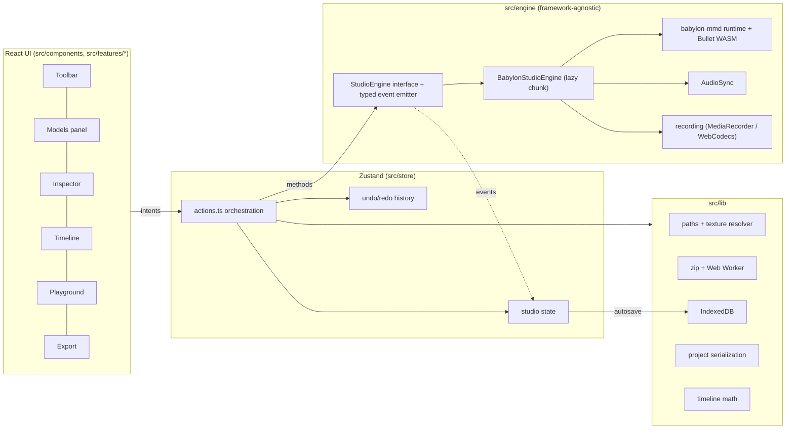

# MMD Studio

A browser-only **MikuMikuDance playground**. You can load PMX/PMD models with their textures, VMD motions, camera motions and music. Play everything back with Bullet physics, adjust morphs, lighting and post-processing, pose bones by hand, and record a PNG or a video. Projects are saved in your browser. There is no backend, and your files never leave your device.

**Live:** https://ijmmni99.github.io/MMD-Playground/

Built with Vite, React 18, TypeScript (strict), Babylon.js 9 and [babylon-mmd](https://github.com/noname0310/babylon-mmd). It also uses Zustand, Tailwind and Radix UI, idb, JSZip, mediabunny (WebCodecs muxing) and Monaco.

---

## Quick start

```bash
pnpm install
pnpm dev            # http://localhost:5173
```

| Command                     | What it does                                             |
| --------------------------- | -------------------------------------------------------- |
| `pnpm build`                | Type-checks and builds a static site into `dist/`        |
| `pnpm preview`              | Serves `dist/` on port 4173                              |
| `pnpm typecheck`            | Runs `tsc -b`                                            |
| `pnpm lint` / `pnpm format` | ESLint / Prettier                                        |
| `pnpm test`                 | Vitest unit tests                                        |
| `pnpm test:e2e`             | Playwright smoke test (run `pnpm build` first)           |
| `pnpm fixtures`             | Regenerates the procedural test model, motions and audio |

Docker (nginx serving the static build):

```bash
docker build -t mmd-studio . && docker run -p 8080:80 mmd-studio
```

GitHub Actions: `ci.yml` runs type-check, lint, unit tests, build and the e2e tests. `deploy.yml` publishes `dist/` to GitHub Pages on every push to `main`.

## Using it

1. **Drop a model folder or ZIP** anywhere on the window. You can also use _Open files…_ or _Open folder…_.
2. **Drop a `.vmd` motion.** It attaches to the newly loaded or selected model. Camera VMDs are detected automatically.
3. **Drop music** (mp3/wav/ogg/m4a/flac), then press **Space**.
4. Tweak morphs, lighting and post-FX in the **Inspector**. Record a video from **Export**.
5. Reload the page. The project is restored from IndexedDB.

No assets? Click **Try the built-in sample**. It's a procedurally generated block figure with physics hair and skirt, a dance, a camera motion and a beat. It is generated by `scripts/make-fixtures.mjs` and is public domain.

## Features

| Area                | Details                                                                                                                                                                                                                                                                                      |
| ------------------- | -------------------------------------------------------------------------------------------------------------------------------------------------------------------------------------------------------------------------------------------------------------------------------------------- |
| **Viewport**        | Resize-aware canvas, orbit and free-fly (WASD/QE) cameras, grid and axis toggles, FPS/draw-call overlay, Low/Medium/High quality presets (resolution scale, MSAA, shadow map size)                                                                                                           |
| **Loading**         | PMX/PMD/BPMX, VMD, camera VMD, audio, HDR/ENV, ZIP packs (unzipped in a Web Worker), folder drops. Texture paths resolve case-insensitively with `\`/`/` normalisation, Shift-JIS ZIP names, NFC/NFD normalisation and a filename fallback. Missing textures get a placeholder and a warning |
| **Models**          | Multiple models with select, show/hide, rename (double-click or F2), duplicate and delete. Each model can have its own VMD                                                                                                                                                                   |
| **Playback**        | Play/pause/stop/seek, loop, 0.25×–2× speed, frame stepping in 30 fps MMD frames, audio offset (ms) and volume                                                                                                                                                                                |
| **Timeline**        | Canvas ruler, playhead scrubbing, Ctrl+wheel zoom and Shift+wheel pan. Keyframe ticks per model, with expandable bone and morph groups down to individual tracks. Camera track and audio waveform                                                                                            |
| **Physics**         | Bullet (WASM) via babylon-mmd: per-model toggle, gravity, substeps, fixed step, reset. If the WASM fails to load, models still load and play without physics                                                                                                                                 |
| **Inspector**       | Morph sliders grouped into eyebrows/eyes/mouth/other with search and reset. Bone tree with search; selecting a bone shows a rotate/move gizmo. Per-material visibility, outline and alpha. Position/rotation/scale                                                                           |
| **Scene**           | Directional light (azimuth, elevation, colour, intensity), hemispheric ambient light, soft PCF shadows. Background: solid, gradient, HDR/ENV skybox or transparent                                                                                                                           |
| **Post-processing** | Bloom, depth of field (with _focus on model head_), FXAA, MSAA, tone mapping (Standard/ACES/Khronos), exposure/contrast, vignette, SSAO, outline/toon strength                                                                                                                               |
| **Camera tools**    | FOV, presets (front/back/left/right/face close-up/¾), follow a bone, switch between the camera VMD and the manual camera                                                                                                                                                                     |
| **Pose & capture**  | Save/load `.pose.json`, reset pose. PNG up to 4K with optional transparency. Video: frame-stepped WebCodecs MP4 (H.264+AAC) or WebM (VP9+Opus) with no dropped frames, or realtime MediaRecorder capture                                                                                     |
| **Projects**        | Debounced autosave to IndexedDB. File blobs are content-addressed and deduplicated. Recent-projects dialog with thumbnails, New project, and `.mmdstudio.zip` export/import                                                                                                                  |
| **Playground**      | Monaco TypeScript editor (bundled, no CDN) with a typed `studio` API, a console and 5 examples: auto blink, morph sequencer, camera orbit, bone wiggle and lighting colour cycle                                                                                                             |
| **UX**              | Dark editor theme; resizable, collapsible panels with a saved layout; toasts and progress bars; onboarding empty state; keyboard shortcuts; undo/redo; ARIA labels and focus rings; tablet layout and a small-screen notice                                                                  |

## Keyboard shortcuts

| Keys                    | Action                                 |
| ----------------------- | -------------------------------------- |
| `Space`                 | Play / pause                           |
| `←` / `→`               | Step one frame (`Shift` steps 10)      |
| `Home` / `End`          | Jump to start / end                    |
| `L`                     | Toggle loop                            |
| `F`                     | Focus the selected model               |
| `R` / `T`               | Switch the bone gizmo to rotate / move |
| `Esc`                   | Deselect the bone                      |
| `Ctrl+S`                | Save project (with thumbnail)          |
| `Ctrl+Z`                | Undo (pose, morph, transform)          |
| `Ctrl+Shift+Z`/`Ctrl+Y` | Redo                                   |
| `?`                     | Shortcut cheat sheet                   |
| `W A S D Q E`           | Move in free-fly camera mode           |

## Playground API

```ts
const m = studio.model(); // selected model (or by name/index)
m.setMorph('まばたき', 1);
m.rotateBone('頭', 10, 20, 0); // degrees
studio.camera.orbit(-90, 80, 40);
studio.lights.set({ dirColor: '#ffaa88' });
studio.scene((s) => void (s.postfx.bloom = true));
studio.onFrame((dt, frame) => {
  /* runs every frame until Stop */
});
studio.every(500, () => studio.log(studio.frame));
```

Scripts run in the page inside `try/catch`, and only through this API. TypeScript is transpiled by Monaco's own TS worker. **Stop** removes every callback the script registered.

## Architecture



- **React never touches Babylon objects.** The UI dispatches intents to `store/actions.ts`. Actions call the typed `StudioEngine` interface and update the store. Engine events (playback, progress, warnings, bone edits) flow back through `features/app/bridge.ts`.
- **The engine is code-split.** `createStudioEngine()` dynamically imports Babylon, babylon-mmd and the Bullet WASM after the UI has painted. Monaco is a separate lazy chunk that only loads on the Playground tab. JSZip and the Shift-JIS tables are also lazy.
- **Resources are disposed.** Removing a model destroys its MMD runtime model and physics bodies, removes its shadow casters and disposes its `AssetContainer` (meshes, materials, textures, skeleton).
- **Audio sync.** The MMD runtime is the master clock. `AudioSync` follows it at `time + offset` and re-seeks only when drift exceeds 80 ms. Audio goes through Web Audio so the recorder can capture it.
- **Frame-stepped recording.** This mode overrides the engine's delta time to `1000/fps`. Every frame is rendered, including the physics step, and encoded with WebCodecs at an exact timestamp. The audio is cut from the decoded buffer and muxed by mediabunny.

## Mobile & tablet

MMD Studio is touch-first on phones and tablets and can be installed as an app (PWA).

| Device / size                     | Layout                                                                                                                                                                                                                                                                           |
| --------------------------------- | -------------------------------------------------------------------------------------------------------------------------------------------------------------------------------------------------------------------------------------------------------------------------------- |
| Phone portrait (< 640 px)         | Full-screen viewport. Panels open as **bottom sheets** (peek / half / full; drag the handle, fling, or swipe down to dismiss). The tab bar has Scene · Models · Inspector · Timeline · Capture · More. A compact transport (play, frame step, scrub bar, time) is always visible |
| Phone landscape (height < 500 px) | Viewport on the left, one collapsible side panel with an icon rail on the right, transport over the viewport                                                                                                                                                                     |
| Tablet (640–1024 px)              | Viewport with overlay drawers (collapsed by default), a bottom timeline, a compact toolbar and a **More** menu                                                                                                                                                                   |
| Desktop (> 1024 px)               | The original dockable three-panel layout (unchanged)                                                                                                                                                                                                                             |

Rotating the device switches layouts without restarting the 3D engine, so the scene, camera and playback survive.

**Gestures**

| Gesture                               | Action                                                 |
| ------------------------------------- | ------------------------------------------------------ |
| One-finger drag                       | Orbit the camera                                       |
| Two-finger pinch / drag               | Zoom / pan                                             |
| Double-tap                            | Focus the selected model                               |
| Tap a model                           | Select it                                              |
| Tap near a bone of the selected model | Select the bone (rotate / move gizmo, larger on touch) |
| Toolbar buttons                       | Rotate / move bone, scale model                        |
| Timeline: drag / pinch                | Scrub / zoom the time range (two-finger drag pans)     |
| Long-press an icon                    | Show its label                                         |
| Hold a − / + stepper                  | Fine-adjust a slider value, with repeat                |

**Loading on a phone:** tap **Add model** and pick the `.pmx` plus its textures, or better, a **.zip** of the model folder (on iPhone: Files app → long-press the folder → Compress). Then use **Add motion** and **Add audio**. On Android you can also share files to the installed app.

**Install:** More → _Install app_. On iPhone/iPad: Safari → Share → _Add to Home Screen_. The service worker caches the app shell and the Bullet WASM for offline use. Your projects stay in IndexedDB and are never cached by the service worker.

**Performance:** touch devices start on the **Low** preset:

- pixel ratio capped at 1.5 (2 on higher presets)
- MSAA off, FXAA on
- 1024 px shadow maps
- textures larger than 1024 px (2048 px on higher presets) are downscaled
- fewer physics substeps

**Lazy engine:** on a first visit, the 3D engine (about 6 MB of Babylon.js + Bullet WASM) only downloads on your first tap, key press or drop, or when an action needs it. Returning visitors with a saved scene get it immediately. Add `?engine=1` to the URL to start it at once.

**Lighthouse (mobile, simulated slow 4G):** Performance 94, Accessibility 100, Best Practices 100. Chromium reports the app as installable, with no installability errors.

**Adaptive quality** (More menu, on by default on mobile) steps quality down when the frame rate stays below 30 fps for 3 s. Rendering pauses when a full-height sheet covers the viewport, and playback pauses when the app goes to the background.

**Mobile limitations**

- **Recording on iOS:** older iOS Safari can't encode video. The Capture panel then offers a **PNG-sequence ZIP** (frame-stepped, no audio) instead.
- **iOS audio:** audio starts after the first tap, because iOS requires a user gesture.
- **Memory:** before loading a PMX larger than 30 MB on a low-memory device, the app asks for confirmation. If the system resets the GPU context, the scene is rebuilt from the autosaved project.
- **Folder picking** isn't available on phones. Use a ZIP.
- **Playground on phones** is a read-only runner for the 5 examples. The full Monaco editor is available on tablet and desktop.

### Testing on a real phone

Some APIs (service worker, share, clipboard, `crypto.subtle`) need a secure context. Serve the build over HTTPS on your LAN:

```bash
pnpm build
# one-time: create a locally trusted certificate (https://github.com/FiloSottile/mkcert)
mkcert -install && mkcert 192.168.1.20 localhost   # use your computer's LAN IP
pnpm exec vite preview --host --https.cert 192.168.1.20+1.pem --https.key 192.168.1.20+1-key.pem
```

Alternatively, use the deployed GitHub Pages site, which is already HTTPS. Install mkcert's root CA on the phone (iOS: Settings → General → About → Certificate Trust Settings) or accept the warning once.

## Tests

- **Unit (Vitest, 85 tests):** path normalisation and texture resolution, including the real PMX fixture, Shift-JIS ZIP names, ZIP round-trips, import planning, project serialisation and `.mmdstudio.zip` round-trip, the IndexedDB store and garbage collection, undo/redo coalescing, timeline maths and VMD detection. Mobile coverage: layout breakpoints, bottom-sheet snapping, tap/double-tap/pinch maths, the adaptive quality controller, texture downscaling and iOS `accept` lists.
- **E2E (Playwright):**
  - **Desktop:** uploads the generated fixtures through the real file chooser, checks the model, motion, camera and audio, plays and pauses, steps frames, downloads a PNG, reloads and checks the project is restored. A second test runs a playground example. A third checks that a first visit does not load the engine until it's needed.
  - **Device matrix:** iPhone 14 and iPad (WebKit) and Pixel 7 (Chromium), each in portrait and landscape. Each run checks for horizontal overflow, the expected layout, sheet / side-panel / drawer navigation, loading a model and motion through the Add buttons, touch orbit and pinch zoom, play/pause, and console errors. If headless WebKit has no WebGL2, only the layout checks run.

Headless Chromium renders WebGL with SwiftShader (CPU), so the e2e tests switch to the Low quality preset. Inside a container that already has Chromium, set `PW_CHROMIUM_PATH=/path/to/chrome`. Without WebKit, `PW_WEBKIT_AS_CHROMIUM=1` runs the iPhone/iPad profiles on Chromium.

## Compatibility

- **WebGL2 is required.** Use a current Chrome, Edge, Firefox or Safari.
- **WebGPU** is opt-in with `?webgpu`. If it fails it falls back to WebGL2.
- **Frame-stepped video** needs WebCodecs (Chromium, recent Safari and Firefox). Otherwise MediaRecorder realtime capture is offered.
- **Physics** uses the single-threaded Bullet WASM build, because static hosts such as GitHub Pages can't send the COOP/COEP headers that the multi-threaded build needs.

## Known limitations

- Manual morph and bone edits apply on top of the motion. While playing, or after a seek, tracks that the VMD keys override your edits. This matches MMD.
- Some features are not supported:
  - VPD poses (use the JSON pose format)
  - Accessories (.x)
  - VMD light and self-shadow tracks
  - Exporting edits back to VMD
  - Multi-camera switching
- Model scaling combined with physics can behave oddly because rigid-body sizes don't scale. Use scale 1 for physics-heavy models.
- Very large PMX files (50 MB+) parse asynchronously with a progress bar. They're stored once in IndexedDB, deduplicated by content hash, so watch the browser's storage quota.
- The bone gizmo rotates in world space around the bone's pivot. Append/IK constraints are then solved by the runtime, so constrained bones may not follow the gizmo exactly.
- The Babylon chunk is large (≈1.3 MB gzip) because it imports Babylon's root barrel to guarantee that all side effects are registered.

## Legal

MMD Studio **ships no third-party models, motions, stages or music**. Every MMD asset you load has its own terms of use, typically covering credit, redistribution, modification, commercial use and content restrictions. **You are responsible for respecting them** when you load, record or publish anything made with this tool. Good starting points are the asset sites linked from the welcome screen (BowlRoll, Niconi Solid, DeviantArt, VPVP wiki). Always read the bundled readme.

The included "Blocky" sample and test fixtures are procedurally generated by `scripts/make-fixtures.mjs` and released into the public domain. babylon-mmd and Babylon.js are licensed under MIT and Apache-2.0 respectively.
