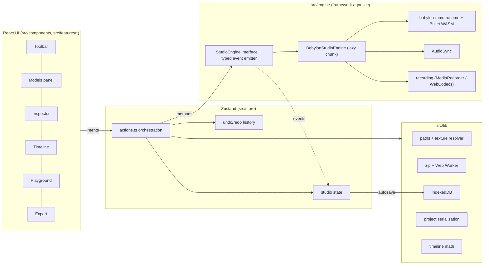
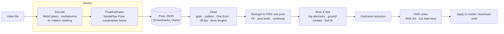
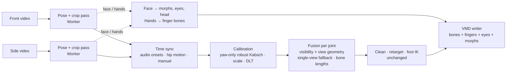
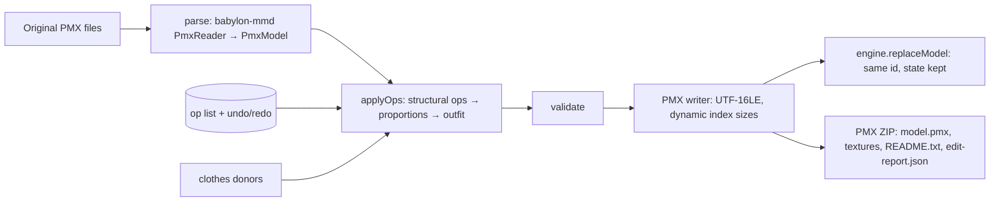

# MMD Studio

A browser-only **MikuMikuDance playground**. You can load PMX/PMD models with their textures, VMD motions, camera motions and music. Play everything back with Bullet physics, adjust morphs, lighting and post-processing, pose bones by hand, and record a PNG or a video. Projects are saved in your browser. There is no backend, and your files never leave your device.

**Live:** https://ijmmni99.github.io/MMD-Playground/

Built with Vite, React 18, TypeScript (strict), Babylon.js 9 and [babylon-mmd](https://github.com/noname0310/babylon-mmd). It also uses Zustand, Tailwind and Radix UI, idb, JSZip, mediabunny (WebCodecs muxing) and Monaco.

---

## Quick start

```bash
pnpm install
pnpm dev            # http://localhost:5173
```

| Command                     | What it does                                             |
| --------------------------- | -------------------------------------------------------- |
| `pnpm build`                | Type-checks and builds a static site into `dist/`        |
| `pnpm preview`              | Serves `dist/` on port 4173                              |
| `pnpm typecheck`            | Runs `tsc -b`                                            |
| `pnpm lint` / `pnpm format` | ESLint / Prettier                                        |
| `pnpm test`                 | Vitest unit tests                                        |
| `pnpm test:e2e`             | Playwright smoke test (run `pnpm build` first)           |
| `pnpm fixtures`             | Regenerates the procedural test model, motions and audio |

Docker (nginx serving the static build):

```bash
docker build -t mmd-studio . && docker run -p 8080:80 mmd-studio
```

GitHub Actions: `ci.yml` runs type-check, lint, unit tests, build and the e2e tests. `deploy.yml` publishes `dist/` to GitHub Pages on every push to `main`.

## Using it

1. **Drop a model folder or ZIP** anywhere on the window. You can also use _Open files…_ or _Open folder…_.
2. **Drop a `.vmd` motion.** It attaches to the newly loaded or selected model. Camera VMDs are detected automatically.
3. **Drop music** (mp3/wav/ogg/m4a/flac), then press **Space**.
4. **Add a stage** (optional) with **Add stage**, or the mountain button in the Scene panel. Stages are ordinary PMX models marked as scenery:
   - taps never select them, and new motions never attach to them;
   - the camera frames the dancers;
   - physics is off;
   - the floor grid and shadow catcher are hidden.

   Models whose name contains _stage_, _ステージ_, _舞台_ or _背景_ are detected automatically. Toggle **Stage (scenery)** in the Inspector to change it.

5. Tweak morphs, lighting and post-FX in the **Inspector**. Record a video from **Export**.
6. Reload the page. The project is restored from IndexedDB.

No assets? Click **Try the built-in sample**. It's a procedurally generated block figure with physics hair and skirt, a dance, a camera motion and a beat. It is generated by `scripts/make-fixtures.mjs` and is public domain.

## Features

| Area                | Details                                                                                                                                                                                                                                                                                      |
| ------------------- | -------------------------------------------------------------------------------------------------------------------------------------------------------------------------------------------------------------------------------------------------------------------------------------------- |
| **Viewport**        | Resize-aware canvas, orbit and free-fly (WASD/QE) cameras, grid and axis toggles, FPS/draw-call overlay, Low/Medium/High quality presets (resolution scale, MSAA, shadow map size)                                                                                                           |
| **Loading**         | PMX/PMD/BPMX, VMD, camera VMD, audio, HDR/ENV, ZIP packs (unzipped in a Web Worker), folder drops. Texture paths resolve case-insensitively with `\`/`/` normalisation, Shift-JIS ZIP names, NFC/NFD normalisation and a filename fallback. Missing textures get a placeholder and a warning |
| **Models**          | Multiple models with select, show/hide, rename (double-click or F2), duplicate and delete. Each model can have its own VMD                                                                                                                                                                   |
| **Video to VMD**    | Convert a dance video into a VMD motion in the browser: MediaPipe pose detection, cleaning, retargeting onto your PMX with foot IK, then .vmd export. See [Video to VMD](#video-to-vmd)                                                                                                      |
| **Playback**        | Play/pause/stop/seek, loop, 0.25×–2× speed, frame stepping in 30 fps MMD frames, audio offset (ms) and volume                                                                                                                                                                                |
| **Timeline**        | Canvas ruler, playhead scrubbing, Ctrl+wheel zoom and Shift+wheel pan. Keyframe ticks per model, with expandable bone and morph groups down to individual tracks. Camera track and audio waveform                                                                                            |
| **Physics**         | Bullet (WASM) via babylon-mmd: per-model toggle, gravity, substeps, fixed step, reset. If the WASM fails to load, models still load and play without physics                                                                                                                                 |
| **Inspector**       | Morph sliders grouped into eyebrows/eyes/mouth/other with search and reset. Bone tree with search; selecting a bone shows a rotate/move gizmo. Per-material visibility, outline and alpha. Position/rotation/scale                                                                           |
| **Scene**           | Directional light (azimuth, elevation, colour, intensity), hemispheric ambient light, soft PCF shadows. Background: solid, gradient, HDR/ENV skybox or transparent                                                                                                                           |
| **Post-processing** | Bloom, depth of field (with _focus on model head_), FXAA, MSAA, tone mapping (Standard/ACES/Khronos), exposure/contrast, vignette, SSAO, outline/toon strength                                                                                                                               |
| **Camera tools**    | FOV, presets (front/back/left/right/face close-up/¾), follow a bone, switch between the camera VMD and the manual camera                                                                                                                                                                     |
| **Pose & capture**  | Save/load `.pose.json`, reset pose. PNG up to 4K with optional transparency. Video: frame-stepped WebCodecs MP4 (H.264+AAC) or WebM (VP9+Opus) with no dropped frames, or realtime MediaRecorder capture                                                                                     |
| **Projects**        | Debounced autosave to IndexedDB. File blobs are content-addressed and deduplicated. Recent-projects dialog with thumbnails, New project, and `.mmdstudio.zip` export/import                                                                                                                  |
| **Playground**      | Monaco TypeScript editor (bundled, no CDN) with a typed `studio` API, a console and 5 examples: auto blink, morph sequencer, camera orbit, bone wiggle and lighting colour cycle                                                                                                             |
| **UX**              | Dark editor theme; resizable, collapsible panels with a saved layout; toasts and progress bars; onboarding empty state; keyboard shortcuts; undo/redo; ARIA labels and focus rings; tablet layout and a small-screen notice                                                                  |

## Keyboard shortcuts

| Keys                    | Action                                 |
| ----------------------- | -------------------------------------- |
| `Space`                 | Play / pause                           |
| `←` / `→`               | Step one frame (`Shift` steps 10)      |
| `Home` / `End`          | Jump to start / end                    |
| `L`                     | Toggle loop                            |
| `F`                     | Focus the selected model               |
| `R` / `T`               | Switch the bone gizmo to rotate / move |
| `Esc`                   | Deselect the bone                      |
| `Ctrl+S`                | Save project (with thumbnail)          |
| `Ctrl+Z`                | Undo (pose, morph, transform)          |
| `Ctrl+Shift+Z`/`Ctrl+Y` | Redo                                   |
| `?`                     | Shortcut cheat sheet                   |
| `W A S D Q E`           | Move in free-fly camera mode           |

## Playground API

```ts
const m = studio.model(); // selected model (or by name/index)
m.setMorph('まばたき', 1);
m.rotateBone('頭', 10, 20, 0); // degrees
studio.camera.orbit(-90, 80, 40);
studio.lights.set({ dirColor: '#ffaa88' });
studio.scene((s) => void (s.postfx.bloom = true));
studio.onFrame((dt, frame) => {
  /* runs every frame until Stop */
});
studio.every(500, () => studio.log(studio.frame));
```

Scripts run in the page inside `try/catch`, and only through this API. TypeScript is transpiled by Monaco's own TS worker. **Stop** removes every callback the script registered.

## Architecture



- **React never touches Babylon objects.** The UI dispatches intents to `store/actions.ts`. Actions call the typed `StudioEngine` interface and update the store. Engine events (playback, progress, warnings, bone edits) flow back through `features/app/bridge.ts`.
- **The engine is code-split.** `createStudioEngine()` dynamically imports Babylon, babylon-mmd and the Bullet WASM after the UI has painted. Monaco is a separate lazy chunk that only loads on the Playground tab. JSZip and the Shift-JIS tables are also lazy.
- **Resources are disposed.** Removing a model destroys its MMD runtime model and physics bodies, removes its shadow casters and disposes its `AssetContainer` (meshes, materials, textures, skeleton).
- **Audio sync.** The MMD runtime is the master clock. `AudioSync` follows it at `time + offset` and re-seeks only when drift exceeds 80 ms. Audio goes through Web Audio so the recorder can capture it.
- **Frame-stepped recording.** This mode overrides the engine's delta time to `1000/fps`. Every frame is rendered, including the physics step, and encoded with WebCodecs at an exact timestamp. The audio is cut from the decoded buffer and muxed by mediabunny.

## Video to VMD

Turn a dance video into an MMD bone motion, entirely in your browser; nothing is uploaded.

- **Desktop / tablet:** switch the mode to **Video → VMD**. The converter opens next to the 3D viewport.
- **Phone:** use **More → Video to VMD**.

The converter walks through six steps:

1. **Import:** pick or drop an MP4, WebM or MOV.
   - You see the duration, resolution, frame rate and whether there is audio.
   - Set a trim range, and drag on the video to crop to the dancer.
   - Videos over 3 minutes or larger than 1080p get a warning, plus a 720p downscale option.
2. **Detect:** frames are decoded frame-accurately and run through **MediaPipe Pose Landmarker (heavy)**.
   - Decoding uses WebCodecs via mediabunny, inside a Worker.
   - MediaPipe uses the GPU delegate, with a CPU fallback.
   - A live skeleton overlay, progress, ETA and cancel / resume are shown.
3. **Clean:** gaps and low-visibility landmarks are interpolated, and the result is resampled to 30 fps.
   - Limb-length outliers are rejected and repaired.
   - A zero-lag One Euro filter smooths the motion, and bone lengths are normalised.
4. **Retarget:** onto the **selected PMX model's own rest pose and hierarchy**, or a standard MMD skeleton if none is loaded.
   - Rotations are computed per bone with hinge limits and quaternion continuity.
   - センター root motion uses leg odometry and ground contact.
   - Optional foot IK pins planted feet. A **quality report** is shown.
5. **Preview:** **Apply to model** plays the motion in the viewport. The source video follows the studio playhead, and scrubbing either one moves both. The video's soundtrack can be copied into the studio's audio slot, with an offset control.
6. **Export:** download the `.vmd`, or the raw pose data as JSON so you can re-run retargeting later without pose detection. Keyframe reduction is adjustable, and the original and reduced key counts are shown.

The session is saved with the project: the source video (up to 200 MB), pose data and settings. Reloading the page restores it.



**Settings.**

- **Presets:**
  - **Balanced**
  - **Slow / clean:** more smoothing.
  - **Fast dance:** keeps sharp hits.
  - **Upper body only:** locks the legs and センター, for seated or waist-up videos.
- **Advanced:**
  - One Euro min cutoff and beta
  - visibility and outlier thresholds
  - mirror (selfie videos)
  - foot IK, or FK-only output with IK disabled in the VMD
  - drive legs
  - scale
  - root and depth motion
  - contact thresholds
  - keyframe reduction

**Tips for good input.**

- Tripod or a static camera.
- The **whole body in frame**, head to feet, for the whole clip.
- **One dancer.** Crop if other people appear.
- A plain background, good even lighting, and clothes that contrast with the background (no baggy dresses that hide the knees).
- 720p–1080p at 30–60 fps is plenty.
- For mirrored front-camera recordings, turn on **Mirror**.

**Limitations.**

- Monocular pose estimation can't see depth well. Moves toward or away from the camera, and the exact feet placement when facing sideways, are approximations.
- Without the **Face** / **Fingers** options, fingers, facial expressions and eye movement stay at rest (see below).
- Assumes a single person, the full body in frame and a mostly static camera. Spins, floor work and occlusions reduce quality, and the quality report flags the affected times.
- 肩 (shoulders) and 腕捩 stay at rest; 手捩 is driven only with **Fingers** on (wrist refinement).
- On phones, analysis runs at up to 720p and 30 fps and is much slower than on a laptop GPU.
- The open-source Chromium builds used by test runners can't decode H.264. Branded Chrome, Edge and Safari can.

**Copyright.** The converter runs locally, but you are responsible for having the rights to the videos you analyse. That includes any music in them, which you can copy into the studio's audio slot. Also respect the terms of use of the models you apply the motion to (many forbid certain content or redistribution of derived works).

**Adding a better pose backend.** Pose estimation sits behind the `PoseEstimator` interface in `src/engine/video2vmd/estimator.ts`.

- **Contract:** `init()`, plus `estimate(frame, timestampMs, timeSec)`, which returns 33 BlazePose landmarks in image and metric world space plus a people count.
- **What happens after it:** cleaning, retargeting and export only consume that `PoseSequence`.
- **Higher-quality estimators:** an SMPL-based one such as WHAM or 4DHumans (on a server, or in WebGPU / ONNX Runtime Web) can be added as another implementation. It would map SMPL joints onto the BlazePose landmark set, register itself in `createEstimator()`, and need no other changes. A future backend could also emit joint rotations directly; the retargeting step would then skip its direction-vector solve.
- **Built-in test backend:** `?pose=synthetic` swaps in a procedural stick-figure dancer, used by the tests and demos.

### Two-view, face and fingers

Three optional upgrades, picked at **Import** with checkboxes or a preset. **Fast** is body only, **Balanced** is body + face, and **Full** is two-view + face + fingers. Single-view body-only stays the default.

- **Two-view (high accuracy):** add a **side video** of the same performance, filmed about 90° from the front one. Depth is what a single camera gets wrong; a side camera sees it directly. Analysis takes about twice as long.
- **Face:** blinks, winks, mouth shapes (あいうえお), expressions, eye direction and head rotation, written as standard MMD morphs plus 両目 (or 左目 / 右目) rotations.
- **Fingers:** open, close, point and spread, written as rotations of the PMX finger bones (親指０–２, 人指 / 中指 / 薬指 / 小指 １–３).



**How two-view works.**

1. **Sync.** Both soundtracks are decoded (downsampled to 11 kHz) and their onset envelopes cross-correlated, giving the offset and a confidence. A clap at the start makes this unambiguous. Without usable audio, the vertical hip motion of both pose tracks is correlated instead. You can always set the offset by hand (frame nudges, side-by-side scrub). Different frame rates and lengths are fine: both go onto one 30 fps timeline over their overlap.
2. **Calibration.** The side camera's angle is found by a robust yaw-only Procrustes (Kabsch) fit of the two views' 3D landmarks over the whole clip, with your angle as the starting guess. A shared scale comes from the body's vertical extent, and camera distances come from weak perspective. Warnings appear when cameras move, the dancer isn't visible in both, or the views are too similar.
3. **Fusion.** Each joint in each frame mixes both views, weighted by landmark visibility and by geometry. Each camera is trusted least along its own viewing direction, so at 90° it is "front for left/right and up/down, side for depth". With an estimated field of view, joints are also triangulated (DLT), and the triangulated point is used where it reprojects better. If one view loses a joint, the other view is used (counted as single-view); if both lose it, the gap is interpolated. Bone lengths are then enforced, and the usual cleaning, retargeting and foot IK run unchanged.
4. **Report and A/B.** You get detection per view, the sync method and confidence, calibration confidence, and the share of joints seen by both views. **Preview** can switch between the two-view and single-view results, with foot-skate and jitter scores for each.

**Filming two views.**

- Two phones on **tripods**, about **90°** apart (front and side), both static for the whole take.
- The **same dancer, full body**, in both shots; similar lighting; a plain background.
- **Clap once** at the start, visible and audible in both.
- 1080p or higher is best, especially for face and fingers.

**The crop pass (face and hands).** The body pose locates the head and both wrists. Smoothed square windows around them are cut from the **full-resolution** frame (not the downscaled analysis frame) and upscaled: 256 px for the face, 224 px for hands. MediaPipe Face / Hand Landmarker runs on each crop, and the landmarks are mapped back to the frame. A hand's left / right side comes from the body wrist it was cropped at, not from the hand model's label, so mirrored videos and the Mirror toggle work. In two-view mode both views are processed, and the larger, more frontal face or hand wins per frame. Crops that are too small (face under ~96 px, hands under ~64 px) raise warnings.

**Face → MMD morphs** (edit the table in the **Clean** step: per-morph source, gain, offset and on / off). Only morphs the selected model has are written, including common aliases (瞬き, ウインク, 眉上…); the rest are listed in the report.

| MMD morph               | Default source (MediaPipe / ARKit blendshapes)                          |
| ----------------------- | ----------------------------------------------------------------------- |
| まばたき                | both eyes closed: min(eyeBlinkLeft, eyeBlinkRight)                      |
| ウィンク / ウィンク右   | one eye closed (left / right only)                                      |
| あ い う え お          | vowels from jawOpen, mouthFunnel, mouthPucker, mouthSmile, mouthStretch |
| ん                      | mouthPress / mouthClose with the jaw shut                               |
| 笑い                    | mouthSmile × 0.6 + cheekSquint × 0.4                                    |
| にやり                  | one-sided smile                                                         |
| 怒り                    | browDown                                                                |
| 困る                    | browInnerUp (minus browOuterUp), plus some browDown                     |
| 上                      | browOuterUp                                                             |
| びっくり                | eyeWide                                                                 |
| others (off by default) | any raw blendshape, e.g. cheekPuff → ぷくー                             |

Blinks use hysteresis and a **minimum length** (3 frames by default), so short blinks survive 30 fps. The mouth uses attack / release smoothing, and small values fall into a deadzone. When the face is lost, the face eases to neutral. Eye direction comes from the irises (clamped ±20° / ±15°), and head rotation from the face matrix is blended into 首 / 頭. **Lip-sync from audio** can replace the video's mouth shapes, while video blinks and expressions are kept.

**Hand landmarks → MMD fingers.**

| MMD bones                    | Driven by                                            |
| ---------------------------- | ---------------------------------------------------- |
| 親指０                       | thumb opposition (out of the palm plane)             |
| 親指１, 親指２               | thumb MCP / IP flexion                               |
| 人指 / 中指 / 薬指 / 小指 １ | MCP flexion + sideways spread                        |
| … ２, … ３                   | PIP / DIP flexion                                    |
| 手首, 手捩                   | palm orientation from the hand (optional refinement) |

Joint angles come from the hand's own landmarks, so they don't depend on its orientation. They are applied about each finger bone's bend axis in the model's own rest pose and clamped to anatomical limits. Impossible frames are dropped. On dropouts the last pose holds for 0.5 s, then the hand relaxes. Snapping low-confidence frames to the nearest preset (open, fist, point, peace, relaxed) is optional.

**Integration.** **Apply to model** plays body, fingers, eyes and face together. With the Clip Timeline open, the body becomes a Dance clip and the face its own Face clip; the Motion Editor edits them like any motion. **Export** lets you choose body, fingers, face morphs and eye bones. The **landmark JSON** keeps both views' body, face and hand landmarks plus the sync and calibration, so conversion can be re-run without ML. Everything is saved with the project and survives `.mmdstudio.zip` export / import.

**Known limits.**

- Two-view needs **static cameras**; any camera move after the start breaks the calibration (the report warns).
- Motion blur, hands crossing or hiding each other, and small faces or hands (far from the camera, low resolution) reduce quality.
- A single view can't see depth well, which is what two-view is for.
- MediaPipe's face model has no tongue, and lip shapes are approximated by five vowels.
- Test runner Chromium builds can't decode H.264; the e2e fixtures are WebM.

**Swapping estimators.** Pose, face and hands sit behind three interfaces, with MediaPipe as the default implementation of each:

- `PoseEstimator` in `src/engine/video2vmd/estimator.ts`;
- `FaceEstimator` in `faceEstimator.ts`: blendshapes, a head matrix and a few mesh points per crop;
- `HandEstimator` in `handEstimator.ts`: 21 image + world points per crop.

`createEstimator`, `createFaceEstimator` and `createHandEstimator` pick the backend. A GPU SMPL-X backend that covers body, face and hands together could implement all three (mapping its joints and expression parameters onto these outputs) without touching cleaning, fusion or retargeting. `?pose=synthetic2` swaps in the synthetic two-camera backends used by the tests.

## Motion Editor & Camera Director

Edit any loaded VMD — keys, curves, IK and the camera — and export it back to valid VMD files.

Open it with **Edit** in the transport bar. The editor shares the timeline's bottom dock (on a phone it opens in the Timeline sheet). **Editing** goes back to the plain timeline.

### Keys

- **Dope sheet:** rows per bone group (center, upper body, arms, legs, IK, fingers…), morphs and the camera. Click / Shift-click / box-select keys, drag to move (Alt-drag copies), double-click a group to select it. Keys snap to whole frames and, with the magnet on, to beats and markers. Ctrl-wheel or pinch zooms, Shift-wheel pans, the ruler scrubs. Shift-drag the ruler to set the **tool range** (Alt-click clears it).
- **Keying:** pose a bone with the gizmo and press **K** (or turn on **Auto** to key every gizmo / slider edit). With no bone selected, K keys every animated bone. Morph sliders key with the smile button.
- **Graph editor:** the selected track's value curves. Rotations show as Euler degrees (unwrapped for continuity; stored as quaternions). Drag keys vertically or type values. The VMD interpolation box edits the selected keys' bezier handles per channel (or all channels), with presets: linear, ease in, ease out, ease in-out, step.
- **Shortcuts:** K key, Delete, Ctrl+C / Ctrl+V (paste at playhead) / Ctrl+D, `[` `]` nudge, arrows step frames, Ctrl+A select all, A frame all, Esc clear selection, Ctrl+Z / Ctrl+Shift+Z undo / redo (200 steps; a drag is one step).

### Motion tools (wand button)

Work on the tool range and either all or only the selected tracks:

- **Time:** trim, delete range, insert frames, retime (speed factor; camera cuts stay cuts), loop N times with seam blending.
- **Mirror** left ↔ right (bone names and X axis, IK included).
- **Smooth** (Gaussian or One Euro, quaternion-safe), **reduce keys** (Douglas–Peucker with position / rotation tolerance) and **bake every frame**.
- **Offset / scale** with falloff, **retarget scale** for differently sized models.
- **Blend:** crossfade into a second VMD at the playhead, or add it as an additive layer.
- **Face:** blink, あいうえお mouth shapes, seeded auto-blink, a talking-mouth pattern.

### IK (footprints button)

- 足ＩＫ / 手ＩＫ bones are tracks. Select one, drag it with the move gizmo — the leg follows through babylon-mmd's solver — and press K. With _Keying an IK bone also keys its FK chain_ the solved knee / thigh are keyed too. A grey cross shows where the target was before the drag.
- **Bake IK → FK** writes the solved chain rotations every frame over the range and turns IK off there (restored after it). **Fit IK from FK** keys the IK targets where FK puts the feet and turns IK on. Both report the maximum target error, so you can see there's no pop.
- **Foot pinning:** pin an IK bone over the range with blend in / out. The planted foot holds its position (captured when you pin), and IK height is clamped at the floor. Pins show as lock bands in the dope sheet and cyan squares in the viewport; they're applied non-destructively and baked on export.
- Overlay of IK chains, targets and knee direction, and a per-model IK solver switch.

### Camera Director (camera button)

- **Key from view:** position the viewport camera and key it at the playhead. **View through camera** does the reverse.
- **3D path** with key positions and the current frustum; select one camera key to drag it in the viewport (the eye moves, the target stays). **Picture-in-picture** shows the VMD camera while you orbit freely.
- **Shots:** from the range or from markers; split at the playhead, merge, reorder (the keys travel with the shot), delete, and choose a hard **cut** or a **blend** per shot. Cuts are written the MMD way: keys on two consecutive frames.
- **Auto camera:** orbit, dolly in, crane up, front → side cut and face close-up, generated on the range with keys on the beat grid and cuts on bar lines.
- **Look-at** a bone (baked into rotation keys, the camera path is kept), seeded **handheld shake**, FOV / distance on selected keys, a depth-of-field preview, and checks that clamp FOV to 1–125° and keep distances valid.
- **Markers & BPM** (flag button): enter or tap the tempo, set the downbeat; the beat / bar grid drives snapping and presets. There is no audio beat detection.

### VMD interpolation notes

- Each bone key stores four bezier curves (X, Y, Z, rotation) as control points `x1, y1, x2, y2` in 0–127; a camera key stores six (X, Y, Z, rotation, distance, FOV). The curve on a key shapes the segment that **ends** at that key, as in MMD.
- Rotations interpolate by slerp (shortest path), so the editor keeps quaternion signs continuous; the graph shows them as Euler degrees only for readability.
- A camera **cut** is two keys on consecutive frames: the first holds the old shot until the next frame. The editor writes cuts this way and never creates accidental ones when baking.
- Bone positions are offsets from the rest pose; 足ＩＫ / つま先ＩＫ keys are IK target offsets. IK on/off per range lives in the VMD's display / IK property track.

### Saving and export

- Every edit autosaves into the project (IndexedDB) and survives `.mmdstudio.zip` export / import; the original motion is kept, so **Revert** and **Compare** (A/B) always work.
- **Export:** the motion `.vmd` with a choice of bone / morph / IK-state tracks, the camera `.vmd` separately (61-byte camera records), and an optional JSON sidecar with markers, BPM, shots and pins. Light and self-shadow tracks in a loaded VMD are preserved.

## Model Converter (FBX / VRM / glTF → PMX)

Turn a non-MMD character into a PMX that dances: open **Model Converter** in the top bar (on a phone: **More → Model Converter**), or simply drop an FBX / VRM / glTF file on the studio. Everything runs in your browser, in a background worker; nothing is uploaded.

### Supported input

| Format     | Versions             | Notes                                                                                                                                               |
| ---------- | -------------------- | --------------------------------------------------------------------------------------------------------------------------------------------------- |
| VRM        | 0.x and 1.0          | humanoid map, expressions / blend shape groups, spring bones, MToon, license meta                                                                   |
| glTF / GLB | 2.0                  | skins, morph targets (incl. sparse), embedded, external or data-URI buffers and textures                                                            |
| FBX        | 7.x binary and ASCII | parsed with three's `FBXLoader` (parse only — no ufbx build is published on npm); cm / m units, embedded media, multi-material meshes, blend shapes |
| ZIP        | —                    | the model plus its textures (recommended on phones)                                                                                                 |

### How it works

```mermaid
flowchart LR
  A[FBX / VRM / glTF / ZIP] --> B[Parse in a worker → SourceModel]
  B --> C[Map bones: VRM map → known rigs → names → structure]
  C --> D[Stand up, face the camera, scale to 20 units, feet on Y = 0]
  D --> E[T-pose → A-pose, mesh re-skinned]
  E --> F[MMD bones, twist bones, leg IK]
  F --> G[Mirror Z + reverse winding, 4 weights, materials, morphs]
  G --> H[Physics: VRM springs or detected hair / skirt chains]
  H --> I[Validate → PMX 2.0 → preview / load / ZIP]
```



1. **Import** — drop or choose files; the summary shows bones, vertices, textures and warnings. Very large models get a warning and downscaled textures.
2. **Check** — every body bone with its confidence. Anything guessed opens the **mapping screen**: tap a body part on the diagram, then the model's bone (works on touch; _Accept suggestions_ confirms the guesses). Non-humanoids (animals, robots) are flagged and convert as static or partially rigged models. MMD-style Japanese bone names (下半身, 腕L, ひざR…) are recognised directly. **Textures** lists each material's image: images in the ZIP that the model file doesn't reference (common with Sketchfab FBX exports: `textures/body.png`, `hair.png`, `face.png`) are linked by material name, and any choice can be changed here. Outline shell meshes are removed (the studio draws its own outlines).
3. **Pose & scale** — rest pose detected (T / A / other); arms are rotated to the MMD A-pose (angle slider) and the mesh is re-skinned so it deforms cleanly. Height, twist bones (腕捩 / 手捩), leg D bones, 肩P, 腰 and texture size are options.
4. **Face** — VRM expressions and morph targets matched to MMD names (まばたき, ウィンク, あいうえお, 笑い, 怒り, 困る…) from VRM presets, ARKit, VRoid `Fcl_*`, VRChat visemes and Japanese / English names; a review table lets you change or drop any mapping. Several sources for one MMD morph become a group morph; unmatched morphs are kept under _Other_.
5. **Physics** — VRM spring bones become rigid bodies and spring joints (stiffness → springs and limits, drag → damping, gravity → mass, hit radius → capsule size). Without VRM data, hair, skirt, tail, ribbon, sleeve, ear and bust chains are found by name or by hanging off the head / hips / chest. Body colliders keep skirts out of the legs. A sway slider and per-chain presets (Soft, Skirt, Stiff) tune it.
6. **Preview** — the converted model plays a built-in procedural test dance (stepping on leg IK, arm waves, blinking, talking) or any VMD; _Show the original_ puts the source geometry next to it.
7. **Export** — the model's license is shown and must be acknowledged; then **Load into studio** (saved with the project and in `.mmdstudio.zip`) or **Download PMX ZIP** (`model.pmx`, `tex/`, `README.txt` with the license, `conversion-report.json`).

Bones, morphs and materials keep Japanese MMD names as their real IDs; the studio shows English labels as usual.

### What works well / known limits

- **Works well:** humanoid Mixamo characters, VRoid / VRM avatars, Unity / Booth anime models with standard skeletons, Blender rigs with `.L` / `.R` naming.
- **Limits:** non-human characters don't dance; unusual rigs may need the mapping screen; generated physics is less tuned than a hand-made PMX; MToon / PBR shaders are approximated with MMD materials (no shader graph, no sphere maps); hair and skirt need actual bones to sway (shape keys can't); FBX animations and cameras are ignored.
- **Better results:** export FBX with skin and blend shapes, in a T- or A-pose, with textures packed or alongside in the ZIP; name morphs after VRM / ARKit conventions; check the Face and Physics steps before exporting.
- **Legal:** you are responsible for the license of every model you convert. The converter never strips license information: VRM metadata (allowed users, commercial use, redistribution, modification) is shown before export and written into the output README; FBX and glTF files usually carry none, so check the terms where you got them (e.g. Adobe's terms for Mixamo characters).

## Model Editor

Edit a loaded PMX / PMD model in the browser and save it back as a PMX: **Model Editor** tab (phones: More → Model Editor). Pick the model at the top. Edits are a non-destructive list on top of the untouched original. Undo / Redo (≥ 200 steps), **Revert** and the **Edited / Original** A/B switch are always visible, and the session is saved with the project (and in `.mmdstudio.zip`).

| Section | What you can do |
|---|---|
| Proportions | Scale head, neck, torso, chest, hips, upper arm, forearm, hands, fingers, thigh, shin, feet or the whole body: overall / length / thickness, 0.5–2× (a warning shows outside it). Left and right can be linked. Tap the model to jump to a part. Presets: Chibi, Long legs, Bigger head, Reset, plus your own, which you can save and load as JSON. Test pose. "Attach" fixes accessories that only follow the root bone. |
| Outfit | Materials are auto-grouped into Hair / Face / Body / Top / Bottom / Shoes / Gloves / Accessories / Other; you can move them or add groups. Hiding a group also removes its physics. You get a hole warning, and "Hide body under it" for clothing. Outfit presets. Recolour: diffuse colour, texture HSV / tint, and uploaded image, logo or pattern (always saved as new files). Clothes from another model with the same skeleton. |
| Materials | Every PMX material field, visibility, solo and outline. Texture list with size and missing flags, preview, replace, and batch downscale to 2048 / 1024. |
| Bones | Searchable tree. Position (numbers or a gizmo), parent, flags and display frame. IK target / chain / loop / angle limits, a knee X-limit button and a knee-flip warning. Add, delete (weights go to the parent) and rename (with a VMD warning and "restore standard name"). Mirror left → right. |
| Morphs | Bilingual search by panel; slider mix → new group morph. Edit members, rename, panel, strength, mirror left → right, reorder and delete. No sculpting. |
| Physics | Rigid body and joint overlay. Edit shape, size, mass, damping, bounce, friction, mode, group, mask, limits and springs. Soft / Skirt / Stiff presets with sway, generate physics for a bone chain, test motion, reset, and a NaN / explosion warning. |
| Info & save | Names and comments (JA / EN), checks, edit history. **Apply to scene** (the model's files become the edited PMX). **Save as PMX ZIP**. Export / import the edit list as JSON. |



**Rules**
- Japanese bone / morph / material names stay the real IDs (motions use them). English labels come from the English names layer.
- Proportions blend each vertex by its bone weights, so joints don't tear. Parts further down a chain move with it. Bones, IK handles, rigid bodies, joints and morph offsets follow, and the feet stay on the floor.
- Clothes swap maps standard bones by name. Extra bones (skirt chains…) are added under collision-free names, with their physics. A standard bone missing in the target refuses the merge with a message. There is no weight transfer.

**Limits:** no mesh sculpting or weight painting. Proportion scaling is per bone segment, so curved limbs scale along one axis. While you drag, the live preview updates the rest-pose mesh only; the skeleton follows on release (about 0.4 s rebuild). TGA / DDS textures can't be recoloured in the browser.

**Legal:** MMD Studio ships no models. Edited models are still their authors' work: follow each model's license, including whether modification and redistribution are allowed. The saved README keeps the original comment and lists the clothes sources.

## Anime / toon looks (NPR)

Give PMX materials an anime look: **Inspector → Looks (anime / toon)**.
- Click **Auto-assign looks**, or pick a look per material.
- Open a material's look (▸) to tweak it live; each slider has a number field and a reset to the preset value.
- **Before / after** switches between the PMX original and the looks.

Looks are saved per model in the project and in `.mmdstudio.zip`, and can be exported and imported as JSON.

| Look | What it does |
|---|---|
| Default (PMX original) | unchanged; it renders exactly as before (tested pixel-for-pixel) |
| Anime Skin | soft toon ramp, warm shadow tint, subtle rim |
| Anime Face | very soft shading (no hard terminator), optional cheek blush |
| Anime Hair | toon ramp, ring-shaped highlight band, rim |
| Cloth Smooth / Cloth Rough | crisp or soft ramp; Rough adds a bump-noise grain |
| Stockings | sheer centre, opaque edges by view angle, sheen, alpha-hash transparency |
| Metal | tight highlight, strong rim, sparkle, partly realistic shading |
| Eye | flat, slightly emissive |
| Flat Unlit | texture colour only |

**Auto-assign** reads the material name, its English name, the dictionary label and the texture file name. Eye,
stockings and metal rules are checked first. Everything else uses the Model Editor's outfit groups:
- hair → Hair;
- face → Face;
- body → Skin;
- top / bottom / gloves → Cloth (Rough for leather, denim, knit);
- shoes → Cloth Rough.

Anything unrecognised stays Default, and materials you set yourself are kept.

**Parameters** (per material):
- shadow colour and saturation;
- ramp softness and shadow line, PMX toon texture as a custom ramp;
- cast-shadow strength, flatten;
- rim strength, colour, width and lit-side mask;
- highlight strength, size, colour and hair band;
- emission, sphere / matcap strength, cloth bump, sparkle, sheen, edge opacity;
- transparency (keep / blend / mask / alpha-hash), blush;
- realistic roughness and "toon vs realistic";
- outline colour and thickness.

**Global controls:** Toon strength, Rim strength, Shadow warmth, outline mode (inverted hull from PMX edges, or a
depth-edge post-process), thinner outlines far away, and "See-through hair over eyes".

**Quality tiers:**

| Tier | What's included |
|---|---|
| High | everything, including the realistic (GGX) blend and sparkle |
| Medium | no realistic blend or sparkle |
| Low | flat toon ramp, shadow tint and outline; alpha-hash becomes a cut-out |

"Auto" follows the render quality: phones start on Low, and adaptive quality steps it down on slow devices. A cost
badge shows when heavy looks are on. If a look fails to compile, its materials fall back to the PMX original with a
message (never a black model). Looks survive a WebGL context loss.

**How it works:** a Babylon `MaterialPlugin` added on top of babylon-mmd's material (see `NPR_PLAN.md`).
Skinning, SDEF, morphs, shadows, the MMD outline and post-processing (bloom, tone mapping) are untouched.
Each preset and tier compiles one shader variant, lazily, and it's cached.

**Known limits:**
- An approximation of anime shading on top of standard lighting: one sun, hemispheric ambient. The HDR environment
  isn't used by looks.
- The hair band and cheek blush are computed from normals, not from UVs or tangents.
- See-through eyes is a depth bias, so it can also show eyes through very close objects.
- Looks need WebGL2; with `?webgpu` they're off.
- There's no node-graph editor in v1.

## Clip Timeline & 3D text

Arrange motions like a video editor: drop VMDs on tracks, cut, repeat and reorder them, add camera cuts, music, face presets and 3D text. Nothing is destructive — clips point into their source files and the timeline is baked into ordinary motions for playback and export.

Open it with **Clips** in the transport bar (it is the default view on phones and tablets). **Edit** opens the keyframe editor.

### Clips

- **What's loaded comes along:** opening Clips puts each model's current dance, the camera motion and the music on the timeline, and a motion loaded later from the Models panel is added to the model's dance track.
- **Tracks:** one dance and one face track per model, a camera track, an audio track and any number of text tracks. Dance clips show stick-figure pose thumbnails, audio clips a waveform.
- **Gestures:** tap selects, drag moves (also onto another track of the same kind), the edge handles trim, long-press then drag reorders (later clips ripple), pinch / Ctrl-wheel zooms. Clips snap to the playhead, clip edges, markers and the BPM grid (magnet button). **Center** keeps the playhead fixed in the middle and scrolls the clips under it.
- **Toolbar:** Undo / Redo, **+** (dance or camera VMD, face presets, music, 3D text, subtitles), Split, Delete, Duplicate, Copy / Paste, Speed (0.25–4×), Mirror, Loop, Join, Volume, Edit text, Keyframes, Export VMD and Revert (back to how the timeline was when you opened it).
- **Shortcuts:** S split, Delete, Ctrl+D duplicate, Ctrl+C / Ctrl+V (paste at the playhead), + / − zoom, arrows step frames, Ctrl+Z / Ctrl+Shift+Z (200 steps; a drag is one step).

### Smooth joins

- **Split** cuts on the exact pose, so the two halves meet without a jump.
- **Crossfade:** neighbouring or overlapping clips blend (8 frames by default, adjustable per clip; rotations slerp, positions lerp, smoothstep weight).
- **Root:** _Reset to origin_ (the default, also for duplicates and pastes) keeps each clip's own placement, so repeats dance in place; _Continue_ starts a clip where the previous one left the model (センター / 全ての親 and the foot IK targets move together, so feet don't slide) — use it for travelling moves. **Use these settings for every clip on this track** applies a join to the whole track.
- **Duplicate / Loop** blend the seam between passes.
- **Camera:** a hard **cut** (written as keys on consecutive frames, as MMD expects) or a **blend**.
- **Keyframes:** double-click a dance, face or camera clip to open it — as it plays, at its place in the timeline — in the Motion Editor. **Back to clips** stores the edit as a new source for that clip; the original file is never touched.

### 3D text

- Real extruded geometry (opentype.js + earcut) with a rounded bevel: Latin, kana, kanji, digits and symbols. Glyph meshes are cached and each clip is one merged mesh.
- **Fonts:** Noto Sans JP plus Bungee, Pacifico and Press Start 2P (all SIL OFL, in `public/fonts` with their licences). Upload your own `.ttf` / `.otf` / `.woff`; it is stored with the project. Characters a font lacks fall back to Noto Sans JP; anything no font has is listed in the panel.
- **Looks:** Solid, Glossy, Neon (emissive + glow), Gradient, Outline, Glass; color, size, letter / line spacing, alignment, depth and bevel; cast-shadow and always-on-top switches.
- **Placement:** fixed in the scene, billboard, attached to a bone with an offset (new text floats above the selected model's head), or a screen caption. **Drag the text in the viewport** (finger or mouse) to move it — captions move up and down the screen; tapping text selects its clip. The panel's Position / Offset fields set exact values.
- **Animation:** in / out — fade, pop, slide, typewriter, wave, spin, drop & bounce, each with its length — and an idle float, pulse or wobble.
- **Subtitles:** import `.srt` or `.lrc`; each line becomes a caption clip on its own track with one shared style (_Use this style for every subtitle line_).
- Text shows in the viewport, screenshots and video export. Detail follows the render quality and steps down by itself if the frame rate drops.

### Saving and export

- The timeline, its sources and uploaded fonts autosave into the project and travel in `.mmdstudio.zip`.
- **Export VMD** writes the baked motion per model and the camera. VMD has no place for text or audio, so they are left out (you are told) — export a video to keep them.

## English names

Bones, morphs and materials show English labels next to their Japanese names, e.g. **Left Arm (左腕)**. It's display only: the Japanese names stay the identifiers in the engine, IK, physics, VMD import / export and project files, so motions keep working.

- **Language:** the **EN / 日本語 / Both** switch at the top of the Model inspector (remembered per device).
- **Search** boxes match English or Japanese, ignoring case, full-width / half-width forms and katakana vs hiragana (`ヒジ` finds 左ひじ, `ＬＥＧ ＩＫ` finds 左足ＩＫ).
- **Tooltips** show the original Japanese name and where the label came from. Guessed labels have a dotted underline and `≈`.
- Labels appear in the inspector (morphs, bone tree, materials), the timeline, the camera follow-bone list and the Motion Editor (dope sheet, graph editor, status bar, IK and Camera Director panels).

### How a name is resolved (first hit wins)

1. **Your label** for this model (see below).
2. **Built-in dictionary** of standard MMD names: the full standard bone set (センター, グルーブ, 上半身2, fingers, 足ＩＫ, つま先ＩＫ, 足D, 腰キャンセル, 肩P…, with 左 / 右 variants), the standard morph set with eyebrow / eye / mouth / other categories (morphs a PMX files under "other" are regrouped by the dictionary), and common material names.
3. **Pattern rules** for non-standard names: 左 / 右 (prefix, suffix or `_L` / `.R`), IK, numbers, full-width digits and letters, and parts like 先 Tip, 親 Parent, 捩 Twist, 補助 Helper, 袖 Sleeve, 髪 Hair, スカート Skirt, リボン Ribbon, 胸 Chest, 目 Eye, 口 Mouth (`右スカート前２` → Right Skirt Front 2). A rule only applies when every part of the name is known.
4. **The PMX's own English name**, if it has one that differs from the Japanese name.
5. **The Japanese name**, unchanged.

### Your labels

Right-click (or long-press on touch) any name → **Rename label…**. The dialog also has **Reset label**, **Reset all labels for this model**, and **Export / Import labels** as a small JSON file you can share for that model. Labels are stored per model (its name plus a hash of its bone and morph names), saved with the project and included in `.mmdstudio.zip`.

### Adding dictionary entries

Edit the JSON files in `src/lib/names/`: `bones.json` (`"sided": true` adds 左 / 右 variants), `morphs.json` (with `category`: `eyebrow`, `eye`, `mouth` or `other`) and `materials.json`. Pattern words live in `patterns.ts`. The unit tests check that every entry has an English label and that no Japanese name appears twice (after full-width / half-width normalisation).

**Limitations:** names the dictionary and patterns don't cover show in Japanese (or the PMX's English name) until you rename them; pattern labels are approximate; nothing is machine-translated and no network is used.

## Mobile & tablet

MMD Studio is touch-first on phones and tablets and can be installed as an app (PWA).

| Device / size                     | Layout                                                                                                                                                                                                                                                                           |
| --------------------------------- | -------------------------------------------------------------------------------------------------------------------------------------------------------------------------------------------------------------------------------------------------------------------------------- |
| Phone portrait (< 640 px)         | Full-screen viewport. Panels open as **bottom sheets** (peek / half / full; drag the handle, fling, or swipe down to dismiss). The tab bar has Scene · Models · Inspector · Timeline · Capture · More. A compact transport (play, frame step, scrub bar, time) is always visible |
| Phone landscape (height < 500 px) | Viewport on the left, one collapsible side panel with an icon rail on the right, transport over the viewport                                                                                                                                                                     |
| Tablet (640–1024 px)              | Viewport with overlay drawers (collapsed by default), a bottom timeline, a compact toolbar and a **More** menu                                                                                                                                                                   |
| Desktop (> 1024 px)               | The original dockable three-panel layout (unchanged)                                                                                                                                                                                                                             |

Rotating the device switches layouts without restarting the 3D engine, so the scene, camera and playback survive.

**Gestures**

| Gesture                               | Action                                                                        |
| ------------------------------------- | ----------------------------------------------------------------------------- |
| One-finger drag                       | Orbit the camera                                                              |
| Two-finger pinch / drag               | Zoom / pan                                                                    |
| Double-tap                            | Focus the selected model                                                      |
| Tap a model                           | Select it                                                                     |
| Tap near a bone of the selected model | Select the bone (rotate / move gizmo, larger on touch)                        |
| Toolbar buttons                       | Rotate / move bone, move model (drag arrows or the floor square), scale model |
| Timeline: drag / pinch                | Scrub / zoom the time range (two-finger drag pans)                            |
| Long-press an icon                    | Show its label                                                                |
| Hold a − / + stepper                  | Fine-adjust a slider value, with repeat                                       |

**Loading on a phone:** tap **Add model** and pick the `.pmx` plus its textures, or better, a **.zip** of the model folder (on iPhone: Files app → long-press the folder → Compress). Then use **Add motion** and **Add audio**. On Android you can also share files to the installed app.

**Install:** More → _Install app_. On iPhone/iPad: Safari → Share → _Add to Home Screen_. The service worker caches the app shell and the Bullet WASM for offline use. Your projects stay in IndexedDB and are never cached by the service worker.

**Performance:** touch devices start on the **Low** preset:

- pixel ratio capped at 1.5 (2 on higher presets)
- MSAA off, FXAA on
- 1024 px shadow maps
- textures larger than 1024 px (2048 px on higher presets) are downscaled
- fewer physics substeps

**Lazy engine:** on a first visit, the 3D engine (about 6 MB of Babylon.js + Bullet WASM) only downloads on your first tap, key press or drop, or when an action needs it. Returning visitors with a saved scene get it immediately. Add `?engine=1` to the URL to start it at once.

**Lighthouse (mobile, simulated slow 4G):** Performance 94, Accessibility 100, Best Practices 100. Chromium reports the app as installable, with no installability errors.

**Adaptive quality** (More menu, on by default on mobile) steps quality down when the frame rate stays below 30 fps for 3 s. Rendering pauses when a full-height sheet covers the viewport, and playback pauses when the app goes to the background.

**Mobile limitations**

- **Recording on iOS:** older iOS Safari can't encode video. The Capture panel then offers a **PNG-sequence ZIP** (frame-stepped, no audio) instead.
- **iOS audio:** audio starts after the first tap, because iOS requires a user gesture.
- **Memory:** before loading a PMX larger than 30 MB on a low-memory device, the app asks for confirmation. If the system resets the GPU context, the scene is rebuilt from the autosaved project.
- **Folder picking** isn't available on phones. Use a ZIP.
- **Playground on phones** is a read-only runner for the 5 examples. The full Monaco editor is available on tablet and desktop.

### Testing on a real phone

Some APIs (service worker, share, clipboard, `crypto.subtle`) need a secure context. Serve the build over HTTPS on your LAN:

```bash
pnpm build
# one-time: create a locally trusted certificate (https://github.com/FiloSottile/mkcert)
mkcert -install && mkcert 192.168.1.20 localhost   # use your computer's LAN IP
pnpm exec vite preview --host --https.cert 192.168.1.20+1.pem --https.key 192.168.1.20+1-key.pem
```

Alternatively, use the deployed GitHub Pages site, which is already HTTPS. Install mkcert's root CA on the phone (iOS: Settings → General → About → Certificate Trust Settings) or accept the warning once.

## Tests

- **Unit (Vitest, 310+ tests):** path normalisation and texture resolution, including the real PMX fixture, Shift-JIS ZIP names, ZIP round-trips, import planning, project serialisation and `.mmdstudio.zip` round-trip, the IndexedDB store and garbage collection, undo/redo coalescing, timeline maths and VMD detection. Mobile coverage: layout breakpoints, bottom-sheet snapping, tap/double-tap/pinch maths, the adaptive quality controller, texture downscaling and iOS `accept` lists.
  - **Video to VMD:**
    - The VMD writer: byte-exact header, 111-byte records, section counts and Shift-JIS names.
    - Round-trips through babylon-mmd's VMD parser and `VmdLoader`.
    - Coordinate conversion and the mirror toggle; One Euro filtering; gap filling and 30 fps resampling.
    - Outlier repair, quaternion continuity, keyframe reduction and foot-contact detection / pinning.
    - Retargeting checked against a procedural stick-figure dancer with known ground truth: limb directions, hinge limits, floor contact, leg odometry and foot pitch.
    - v2 (two-view, face, fingers), against a synthetic dancer with fingers and a face seen by two virtual cameras with monocular depth error:
      - 23-byte morph records and a babylon-mmd round trip with body, finger and morph tracks;
      - audio and motion sync with known offsets; yaw-only Kabsch recovering known angles under noise and outliers; DLT triangulation;
      - fusion weighting and single-view fallback; bone-length enforcement; **two-view joint error below 70 % of single-view** on depth-heavy motion;
      - blendshape → morph mapping, gain / offset / enable and aliases; blink minimum duration; attack / release; gaze from irises; head from the face matrix (front and side views); audio lip-sync;
      - finger flexion for every preset, both hands, any orientation; limit clamping; left / right resolution with the mirror toggle; dropout hold and relax; finger rotations curling toward the palm on a PMX-style rig;
      - crop-window tracking and mapping back to the frame, and the crop pass inside the detection pipeline.
  - **Motion Editor:** VMD read/write round-trips (byte-stable, 23-byte morph and 61-byte camera records, babylon `VmdLoader` parity), the runtime animation builder, bezier evaluation against babylon-mmd, key editing / copy / paste / snapping, Euler display and quaternion continuity, every motion tool (trim, retime, loop seams, mirror, smoothing, reduce / bake, blend, additive), foot pins and IK property writes, camera geometry against `MmdCamera`, look-at, shots and cuts, presets on the BPM grid and shake.
  - **Model converter:** PMX writer byte layout and round-trip through babylon-mmd's `PmxReader`, glTF / VRM 0.x / 1.0 / ASCII-FBX parsing of a procedural humanoid, name analysis and mapping for Mixamo, VRoid, Blender and scrambled rigs, orientation / scale / grounding, T- to A-pose rebind (vertices exact), winding after the Z mirror, weight limits, IK chains, morph name matching, capsule orientation against Babylon, VRM spring chains, static (non-humanoid) conversion and manual mapping overrides.
  - **Clip timeline:** clip segments match the motion tools, split continuity at any speed and inside loops, ops (move / trim / split / duplicate / reorder / paste), overlap and adjacent crossfades, root continuity, camera cut / blend, face overrides, snapping, timeline serialisation, SRT and LRC parsing. 3D text: closed, outward-facing meshes (signed volume and normal checks) for Latin, kana, kanji, digits and symbols with real fonts, holes with either winding, font fallback and missing-glyph reports, multi-line layout and alignment, glyph caching, and every in / out / idle animation.
  - **Looks (NPR):**
    - auto-assign rules for Japanese, English, dictionary and texture names;
    - preset ranges, distinct presets, clamped overrides, global controls;
    - tier selection and feature sets;
    - JSON, project and `.mmdstudio.zip` round trips with validation.
  - **Model Editor:** full PMX 2.0 round trip (SDEF / QDEF, extra UVs, every morph type, custom toon, external parent) against a procedural humanoid with fingers, IK, skirt physics and outfit materials. Also: op list and undo / redo (coalescing, depth); hands-only scaling with no seam; long legs with planted feet, IK, bodies and joints following; head morphs; whole-body and presets; outfit grouping, skirt hiding with its physics, body under clothes, hole warnings; bone rename / add / delete / reparent / IK / mirror; group morphs, reorder, delete, scale, mirror; physics presets, auto physics, NaN checks; attach-to-bone; clothes swap and the refusal message for different skeletons; texture recolour maths.
  - **English names:** dictionary integrity, resolution order, left / right and full-width pattern rules, bilingual search, per-model name tables, label overrides and their `.mmdstudio.zip` round-trip.
- **E2E (Playwright):**
  - **Looks (NPR):** a procedural humanoid with skin, face, hair, cloth, knee socks, metal and eyes (`e2e/fixtures/LookTest`). The test checks:
    - Default matches the renderer with NPR switched off;
    - every preset compiles at every tier and changes the image (pixel diffs, distinct per preset);
    - a deliberately broken variant falls back with a message;
    - skinning and morphs still work with looks applied;
    - see-through hair over eyes, per-material and post-process outlines;
    - tiers follow the render quality;
    - context loss keeps looks;
    - three models with looks;
    - the UI flow: auto-assign, live tweak, before / after, undo, save and reload;
    - phones use the Low tier with 44 px targets.
  - **Model Editor:** procedural model + same-skeleton jacket donor (`e2e/fixtures/EditTest`, `EditDonor`; regenerate with `GEN_FIXTURES=1 pnpm vitest run src/lib/model-edit/genFixtures.test.ts`). It drags the hand slider, lengthens the legs, hides the skirt, recolours the top and its texture, builds a group morph, swaps in the jacket, then undoes and redoes, saves the ZIP and reloads with every edit restored. Phone and tablet variants check 44 px targets and layout.
  - **English names:** a generated PMX with Japanese bones, morphs and materials (`e2e/fixtures/NameTest`): labels in every panel, EN / 日本語 / Both, search in both languages, renaming and resetting labels, reload persistence while the motion still plays, and a phone variant with long-press rename.
  - **Motion Editor:** loads the Mannequin rig with a generated dance VMD and camera, drags keys, undo / redo, keys a pose, edits curves in the graph editor, smooths and mirrors, drags an IK target and keys it, bakes IK → FK and fits IK back (checking the target error), pins a foot (the ankle stays put), builds a two-shot camera with a cut, an orbit preset on the beat grid and a look-at, turns on PiP, exports both VMDs and checks they're restored after a reload. Phone and tablet variants check touch selection, 44 px targets and layout.
  - **Model converter:** a VRM through every step (mapping, face, physics, test dance with bounded physics, original side by side), license gate, ZIP contents, load into the studio, a VMD with IK feet, reload; FBX and glTF ZIPs with external textures; a mis-named rig fixed in the mapping screen; phone and tablet. Fixtures are procedural (`e2e/fixtures/converter`, regenerate with `GEN_FIXTURES=1 pnpm vitest run src/lib/convert/genFixtures.test.ts`).
  - **Clip timeline:** two dances back to back, split with S, select and Ctrl+D, undo / redo, drag-move and trim, retime, a camera clip and a face preset, playback through the baked timeline, the keyframe-editor round trip, VMD export and a reload restoring every clip. A text test checks bone-attached text above the head facing the camera, editing in the text panel (neon, typewriter), neon pixels in a screenshot, a recorded video, SRT import as timed captions and that removed text frees its meshes, materials and glow layer. Phone and tablet variants check the default view, 44 px targets, touch selection and the text sheet.
  - **Desktop:** uploads the generated fixtures through the real file chooser, checks the model, motion, camera and audio, plays and pauses, steps frames, downloads a PNG, reloads and checks the project is restored. A second test runs a playground example. A third checks that a first visit does not load the engine until it's needed.
  - **Video to VMD:**
    - Runs the converter on a generated stick-figure video (`e2e/fixtures/stick-dance.webm`) with the synthetic pose estimator.
    - The target is a generated PMX rig with real leg IK (`e2e/fixtures/Mannequin`).
    - Covers cancel / resume, the quality report, apply and play, ankles staying above the floor, and audio extraction.
    - Validates the downloaded VMD and loads it back as a motion, then checks the session is restored after a reload.
    - A phone variant runs the flow in the bottom sheet.
    - **Full preset (two-view + face + fingers):** two generated videos from cameras 90° apart with a 0.4 s offset and a clap in the audio (`e2e/fixtures/twoview-*.webm`, `pnpm fixtures:twoview`) and a PMX with full fingers, eyes and face morphs (`e2e/fixtures/FaceHands`, `GEN_FIXTURES=1 pnpm vitest run src/lib/video2vmd/genFixtures.test.ts`), with the synthetic two-camera estimators. It checks the audio sync (≈ +400 ms), the calibration (≈ 90°), the report sections, fingers closing and blinks on the model, Dance + Face clips on the Clip Timeline, part-selective export, loading the exported VMD, and reload restore. Phone and tablet variants check the layout and the memory warning.
  - **Device matrix:** iPhone 14 and iPad (WebKit) and Pixel 7 (Chromium), each in portrait and landscape. Each run checks for horizontal overflow, the expected layout, sheet / side-panel / drawer navigation, loading a model and motion through the Add buttons, touch orbit and pinch zoom, play/pause, and console errors. If headless WebKit has no WebGL2, only the layout checks run.

Headless Chromium renders WebGL with SwiftShader (CPU), so the e2e tests switch to the Low quality preset. Inside a container that already has Chromium, set `PW_CHROMIUM_PATH=/path/to/chrome`. Without WebKit, `PW_WEBKIT_AS_CHROMIUM=1` runs the iPhone/iPad profiles on Chromium.

## Compatibility

- **WebGL2 is required.** Use a current Chrome, Edge, Firefox or Safari.
- **WebGPU** is opt-in with `?webgpu`. If it fails it falls back to WebGL2.
- **Frame-stepped video** needs WebCodecs (Chromium, recent Safari and Firefox). Otherwise MediaRecorder realtime capture is offered.
- **Physics** uses the single-threaded Bullet WASM build, because static hosts such as GitHub Pages can't send the COOP/COEP headers that the multi-threaded build needs.

## Known limitations

- Manual morph and bone edits apply on top of the motion. While playing, or after a seek, tracks that the VMD keys override your edits. This matches MMD.
- Some features are not supported:
  - OBJ, Collada, .blend and other model formats (FBX, VRM and glTF go through the Model Converter)
  - VPD poses (use the JSON pose format)
  - Accessories (.x)
  - Rendering VMD light and self-shadow tracks (they are kept and re-exported, not shown)
- Clip timeline: face clips use standard MMD morph names (まばたき, あいうえお, 笑い…); models without them show no change (you're warned when adding one). One audio file plays at a time (adding music replaces the audio clip); text doesn't cast shadows from captions, and per-letter animations update vertex positions on the CPU while they run.
- Motion Editor: no physics editing (hair / skirt follow the simulation); fingers are ordinary tracks (no dedicated hand-pose tools); BPM is set by hand or tap tempo (no audio beat detection); depth of field is a preview only and isn't stored in the VMD.
- Model scaling combined with physics can behave oddly because rigid-body sizes don't scale. Use scale 1 for physics-heavy models.
- Very large PMX files (50 MB+) parse asynchronously with a progress bar. They're stored once in IndexedDB, deduplicated by content hash, so watch the browser's storage quota.
- The bone gizmo rotates in world space around the bone's pivot. Append/IK constraints are then solved by the runtime, so constrained bones may not follow the gizmo exactly.
- The Babylon chunk is large (≈1.3 MB gzip) because it imports Babylon's root barrel to guarantee that all side effects are registered.

## Legal

MMD Studio **ships no third-party models, motions, stages or music**. Every MMD asset you load has its own terms of use, typically covering credit, redistribution, modification, commercial use and content restrictions. **You are responsible for respecting them** when you load, record or publish anything made with this tool. Good starting points are the asset sites linked from the welcome screen (BowlRoll, Niconi Solid, DeviantArt, VPVP wiki). Always read the bundled readme.

The included "Blocky" sample and test fixtures are procedurally generated by `scripts/make-fixtures.mjs`, `scripts/make-mannequin.mjs` and `scripts/make-video-fixture.ts` and released into the public domain. Video to VMD uses MediaPipe Tasks Vision (Apache-2.0); its pose model is downloaded from Google's model CDN on first use and cached. babylon-mmd and Babylon.js are licensed under MIT and Apache-2.0 respectively.
